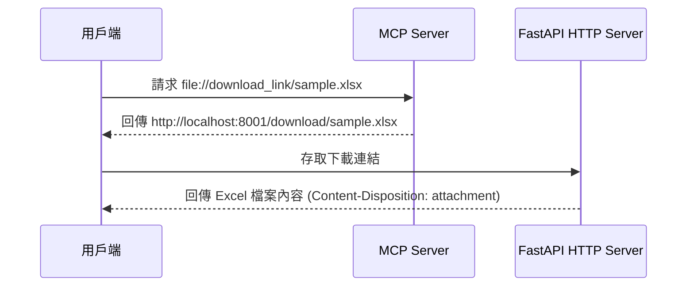

# mcp-practice

## MCP resource + FastAPI HTTP server 傳遞 Excel 檔案流程

```mermaid
sequenceDiagram
    participant User as 用戶端
    participant MCP as MCP Server
    participant HTTP as FastAPI HTTP Server

    User->>MCP: 請求 file://download_link/sample.xlsx
    MCP-->>User: 回傳 http://localhost:8001/download/sample.xlsx
    User->>HTTP: 存取下載連結
    HTTP-->>User: 回傳 Excel 檔案內容 (Content-Disposition: attachment)
```